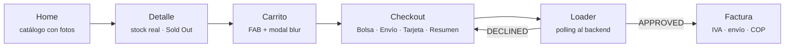

# Borcelle — Mobile

App **React Native (TypeScript)** de la boutique de ropa **BORCELLE**: catálogo con fotos reales, checkout de 4 pasos con tarjeta <span style="color:#4F6BD8"><b>tokenizada</b></span>, estado del pago resuelto por <span style="color:#4F6BD8"><b>polling</b></span> al backend y facturas guardadas con <span style="color:#4F6BD8"><b>cifrado</b></span> en el dispositivo.


<p align="center">
  
</p>

## ⚡ Flujo de la app (simplificado)



1. El catálogo llega del backend con <span style="color:#4F6BD8"><b>precio base</b></span>, stock y tasa de <span style="color:#4F6BD8"><b>IVA</b></span>.
2. En el checkout la tarjeta se <span style="color:#4F6BD8"><b>tokeniza</b></span> directo contra la pasarela — el número **nunca** pasa por nuestro backend ni se persiste.
3. Cada producto del carrito genera **una orden**; la app hace <span style="color:#4F6BD8"><b>polling</b></span> a `GET /orders/:id` hasta <span style="color:#2E9E6B"><b>APPROVED</b></span> o <span style="color:#E5484D"><b>DECLINED</b></span>.
4. La compra se guarda **cifrada** (Keychain/Keystore) y el éxito aterriza directo en su factura.

## ✨ Features

### Catálogo y descubrimiento
- <span style="color:#4F6BD8"><b>Home</b></span> — hero de campaña, carousel infinito autodesplazable ("Moda") y mosaico bento de categorías full-bleed.
- <span style="color:#4F6BD8"><b>Búsqueda glassmorphism</b></span> — se despliega desde la tab bar con sugerencias de productos.
- <span style="color:#4F6BD8"><b>Detalle de producto</b></span> — stock real, tallas, acabados en colores de marca, selector de cantidad y badges de garantía/envíos.
- <span style="color:#4F6BD8"><b>Sold Out</b></span> — sello inclinado en Oi sobre la foto (fondo animado primary ⇄ secondary) y compra deshabilitada al agotarse el stock.
- <span style="color:#4F6BD8"><b>Video banner</b></span> — clip de marca en loop a 1.5×, con el logo como marca de agua; banda de **suscripción** con fondo animado y validación de email.

### Carrito y checkout
- <span style="color:#4F6BD8"><b>Carrito flotante</b></span> — FAB con badge en vivo y modal bottom-sheet con blur, cantidades editables y limpiar carrito.
- <span style="color:#4F6BD8"><b>Checkout en 4 pasos</b></span> — Bolsa → Envío (validado campo a campo, con autorrelleno de prueba) → Tarjeta → Resumen completo.
- <span style="color:#4F6BD8"><b>Desglose de IVA</b></span> — subtotal, `IVA (18%)` y **Total con IVA** visibles antes de pagar; los montos definitivos los persiste el backend.
- <span style="color:#4F6BD8"><b>Tarjetas</b></span> — detección de marca (Visa/Mastercard), validación Luhn, máximo 2 tarjetas guardadas por sesión y botones de tarjetas de prueba.
- <span style="color:#4F6BD8"><b>Loader por etapas</b></span> — progreso con mensajes rotativos y transiciones de color reveladas desde el centro; éxito, rechazo y error con reintento.

### Facturas
- <span style="color:#4F6BD8"><b>Historial cifrado</b></span> — cada compra se guarda con `react-native-keychain` (nunca el número de tarjeta; hay un test que lo garantiza).
- <span style="color:#4F6BD8"><b>Factura BORCELLE</b></span> — recibo con borde troquelado, sello de estado, envío completo, tabla de items y desglose `Precio sin IVA / IVA aplicado / Precio Total` (el total en la fuente de marca **Oi**), sobre un fondo que cicla colores suavemente.
- <span style="color:#4F6BD8"><b>Aterrizaje directo</b></span> — al aprobarse el pago, la app navega a la factura recién emitida, no a la lista.

### Base técnica
- <span style="color:#4F6BD8"><b>Design system</b></span> — todo el styling sale de tokens de `@theme` (colores, tipografía Oi/Instrument Sans, `moderateScale`); sin hex ni px sueltos.
- <span style="color:#4F6BD8"><b>Navegación anidada</b></span> — stack raíz + bottom tabs con stacks internos; la tab bar flotante y el FAB se ocultan según la pantalla.
- <span style="color:#4F6BD8"><b>Estado Flux</b></span> — Redux Toolkit con slices de UI, productos, carrito y órdenes (`submitOrders` orquesta creación + polling por orden).
- <span style="color:#4F6BD8"><b>Moneda local</b></span> — precios formateados `$ 179.900 COP`, con el código en Oi vía el componente `PriceText`.

## 🔧 Requisitos y arranque

- Node ≥ 22.11 · Android SDK (o Xcode en macOS) · el [backend Borcelle](../Boutique-Backend/README.md) corriendo — o la API en vivo: [`borcelle-api.ondeploy.store`](https://borcelle-api.ondeploy.store/docs).

```sh
npm install
cp .env.example .env          # API_URL según tu target

# Dispositivo físico Android por USB:
adb reverse tcp:8081 tcp:8081   # Metro
adb reverse tcp:3000 tcp:3000   # API

npm start                     # Metro
npm run android               # build & install
npm run ios                   # (macOS) pod install primero
```

| Variable (`.env`) | Descripción |
|---|---|
| `API_URL` | Base del backend — `https://borcelle-api.ondeploy.store` (producción) o `http://localhost:3000` (local, con `adb reverse`) |
| `PAYMENTS_API_URL` | Sandbox de la pasarela (tokenización de tarjeta) |
| `PAYMENTS_PUBLIC_KEY` | Llave pública sandbox |

> El `.env` está en `.gitignore` — las llaves nunca se commitean.

## ✅ Tests y calidad

```sh
npm test              # 28 suites · 106 tests (Jest)
npm run lint          # ESLint
npx tsc --noEmit      # typecheck
```

| Cobertura | % |
|---|---|
| Statements | 90.7% |
| Lines | 90.7% |
| Functions | 82.2% |
| Branches | 75.9% |

Cubren: el flujo completo de checkout (bolsa, envío, tokenización de tarjeta y pago aprobado/rechazado/error), slices y polling de órdenes, guardado cifrado (con guardia anti-PAN), cliente HTTP y servicio de pagos, validaciones, formateo de moneda e IVA, componentes de UI/UX (loaders, sold out, carrito) y las pantallas de catálogo y facturas.

## 📐 Convenciones

Arquitectura y reglas del repo en [Claude.md](Claude.md): componentes presentacionales reutilizables, lógica en `src/lib`, capas `ui/ux/features/layout`, textos en español y estilos solo por tokens.
